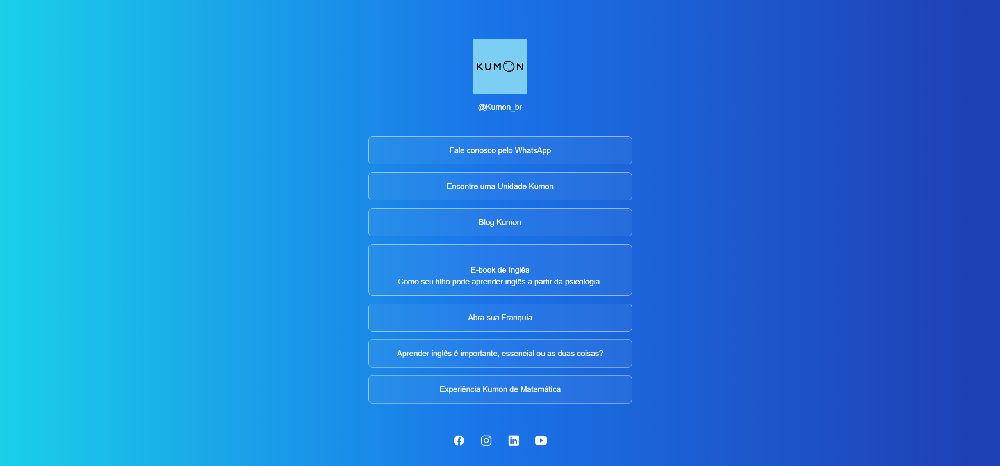

<h1 align="center"> Kumon Hyperlinks </h1>

    Programa desenvolvido a partir do curso Discover da RocketSeat

  <a href="#-tecnologias">Tecnologias</a>&nbsp;&nbsp;&nbsp;|&nbsp;&nbsp;&nbsp;
  <a href="#-projeto">Projeto</a>&nbsp;&nbsp;&nbsp;|&nbsp;&nbsp;&nbsp;

 

  

## 🚀 Tecnologias

Esse projeto foi desenvolvido com as seguintes tecnologias:

- HTML e CSS
- Git e Github

## 💻 Projeto

Este projeto é um agregador de Link com o fim de demonstrar meus conhecimentos e habilidades de programação Web